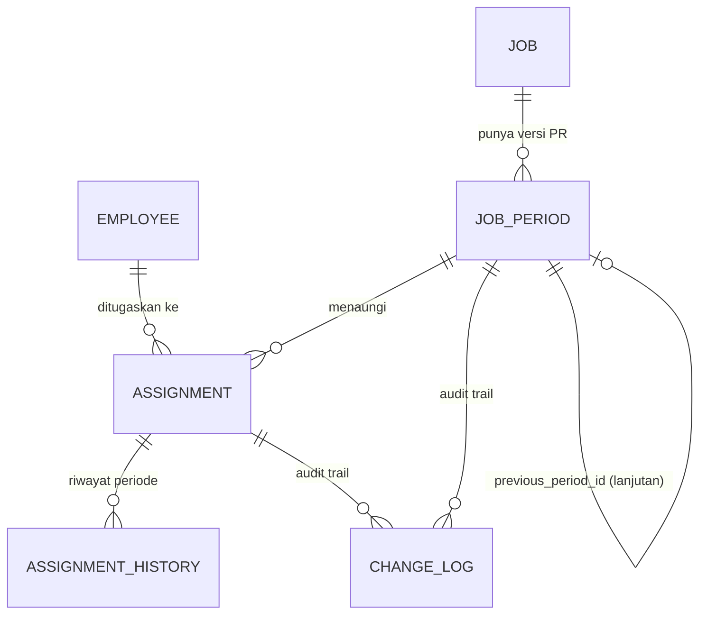

# PRD — Sistem Manajemen Pekerja, Pekerjaan & PR (Codename: WorkTrack)

Versi: 0.1 (Draft untuk direview)
Tanggal: 09 September 2026
Stack: Laravel (latest) + Inertia.js + React + Docker + PostgreSQL

---

## 1. Latar Belakang

Pengguna mengelola pekerja **Helper Non-Rutin** (pekerjaan sementara, 2 minggu s/d lebih dari setahun) untuk klien (PLN). Setiap pekerjaan diikat ke **No. PR/PO/DO** yang menjadi acuan pembayaran. Untuk pekerjaan jangka panjang, No. PR diperbarui tiap 3 bulan oleh user PLN — kadang sebagai kelanjutan pekerjaan yang sama, kadang sebagai pekerjaan baru.

Saat ini pengelolaan dilakukan lewat spreadsheet Excel (lihat contoh data karyawan & data pekerjaan/PR yang dilampirkan). Masalah utama:

- Data karyawan tersebar dan berpotensi duplikat antar sheet pekerjaan.
- Saat tanggal mulai/selesai kerja atau No. PR diperbarui, data lama tertimpa — histori periode sebelumnya hilang.
- Rekap absensi mingguan butuh kepastian: pekerja ini aktif di job apa, dengan No. PR mana, pada periode berapa — dan itu makin sulit ditelusuri begitu ada perubahan.

## 2. Tujuan

1. Satu sumber data karyawan yang konsisten (tidak duplikat, NIK unik).
2. Setiap perubahan periode kerja pekerja **dan** perubahan No. PR tersimpan sebagai riwayat yang bisa dikueri (bukan sekadar log teknis), bukan ditimpa.
3. Memungkinkan rekonstruksi "siapa bekerja di job apa, dengan No. PR mana, pada minggu tertentu" kapan pun dibutuhkan untuk rekap mingguan.
4. Mengurangi ketergantungan pada Excel sebagai sumber kebenaran (source of truth), sambil tetap mendukung import dari format Excel yang sudah ada.

## 3. Definisi & Istilah

| Istilah | Arti |
|---|---|
| Helper Non-Rutin | Pekerja dengan penugasan tidak tetap, jangka waktu bervariasi |
| Job / Pekerjaan | Entitas kerja jangka panjang, mis. "Mesin 2", "Siaga Ubur Ubur" — **independen** dari No. PR |
| PR / PO / DO | Kode dokumen acuan pembayaran; PR biasa diperbarui tiap 3 bulan untuk job jangka panjang |
| Job Period | Satu masa berlaku No. PR tertentu untuk sebuah Job (punya tanggal mulai/selesai & nilai PO sendiri) |
| Assignment (Penugasan) | Ikatan satu pekerja ke satu Job Period, dengan tanggal mulai/selesai miliknya sendiri |
| Rekap Mingguan | Proses pencocokan absensi pekerja per minggu terhadap job & PR yang berlaku |

## 4. Asumsi & Keputusan Desain — **WAJIB DIKONFIRMASI SEBELUM DEV DIMULAI**

Ini bukan detail kecil — beberapa memengaruhi struktur database secara fundamental.

| # | Asumsi/Keputusan | Konsekuensi jika salah |
|---|---|---|
| A1 | **Job** dan **Periode PR** adalah entitas terpisah (bukan 1 tabel). Job = identitas pekerjaan jangka panjang; Periode PR = versi kontrak 3-bulanan di bawah Job itu. | Jika salah, riwayat PR-lanjutan-job-sama vs job-baru tidak bisa dibedakan secara bersih. |
| A2 | Keputusan "PR baru ini lanjutan Job lama / Job baru sama sekali / Job & PR sama tapi assignment beda" **tidak diotomatiskan** — staf input memilih manual lewat UI setiap kali ada pembaruan PR. | Jika diasumsikan bisa otomatis (mis. cocokkan nama job), akan salah klasifikasi untuk kasus ambigu. |
| A3 | Riwayat periode Assignment disimpan sebagai **baris periode berurutan** (append-only), bukan hanya log field-diff generik. | Jika hanya pakai audit log generik, rekap mingguan tetap butuh rekonstruksi manual — masalah asal tidak selesai. |
| A4 | NIK dan No. Rekening disimpan sebagai **string**, bukan numerik (ada leading zero pada data contoh: `0710575450`). | Jika numerik, nomor rekening/NIK berawalan nol akan korup. |
| A5 | Kolom sumber `NO. DO/PR/WO` (teks bebas gabungan) dan kolom `PO` (mis. `PTC03E`) adalah **dua konsep berbeda** — nomor dokumen referensi vs kode PO/cost-center. Disimpan di field terpisah, bukan digabung. | Jika digabung, pencarian/filter berdasarkan No. PR spesifik jadi tidak mungkin. |
| A6 | Rekap absensi mingguan **belum** menjadi modul penuh di Fase 1 — sistem hanya menyediakan data referensi (siapa aktif, di job/PR mana, periode berapa) melalui laporan/filter. Proses pencocokan absensi aktual tetap manual (Excel) untuk saat ini. | Jika asumsi ini salah dan kamu memang butuh input absensi harian di sistem, itu modul terpisah yang lebih besar — perlu didiskusikan lebih dulu. |
| A7 | Role pengguna: Admin (full access), Staff Input (CRUD data operasional, tanpa hapus permanen), Viewer (read-only, mis. untuk Finance). Detail hak akses per role perlu dikonfirmasi. | — |
| A8 | Data historis **tidak pernah dihapus permanen** — hanya ditandai selesai/superseded. Soft-delete/status flag, bukan hard delete. | Jika hard delete diizinkan, requirement histori jadi tidak terjamin. |

## 5. Lingkup

**Masuk Fase 1 (MVP):**
- Data Karyawan (CRUD + import Excel + unique NIK)
- Data Job (master pekerjaan)
- Data Periode PR per Job (dengan alur keputusan lanjutan/job baru)
- Assignment pekerja ke Periode PR, dengan riwayat periode penuh
- Laporan: siapa aktif di job/PR apa pada rentang tanggal tertentu (dasar untuk rekap mingguan manual)
- Import data dari format Excel yang sudah ada (dengan proses parsing & validasi)

**Tidak masuk Fase 1 (kandidat Fase 2+):**
- Modul input absensi harian/mingguan langsung di sistem
- Perhitungan payroll otomatis (gaji pekerja, margin PT)
- Reminder otomatis H-14 sebelum PR harus diperbarui
- Dashboard analitik lanjutan
- Integrasi dengan sistem PLN atau perbankan

## 6. Model Data

### 6.1 Ringkasan Entitas

```
Employee (Karyawan)
Job (Pekerjaan Master)
JobPeriod (Periode PR/PO/DO di bawah satu Job)
Assignment (Penugasan Karyawan ke satu JobPeriod)
AssignmentHistory (versi-versi lama dari Assignment — append-only)
ChangeLog (audit generik: siapa, kapan, apa yang diubah — pelengkap AssignmentHistory)
User / Role
```

### 6.2 Diagram Relasi (ERD ringkas)



### 6.3 Detail Field per Entitas

**Employee (karyawan)**
| Field | Tipe | Catatan |
|---|---|---|
| id | UUID/bigint | PK |
| nik | string(16), unique | Wajib string, bukan integer |
| nama | string | |
| alamat | text | |
| no_rekening | string | Wajib string (leading zero) |
| nama_bank | string, nullable | Tidak ada di sumber saat ini, disarankan ditambah |
| status | enum(aktif, non-aktif) | |
| created_at, updated_at | timestamp | |

**Job (pekerjaan_master)**
| Field | Tipe | Catatan |
|---|---|---|
| id | UUID/bigint | PK |
| nama_pekerjaan | string | mis. "Mesin 2", "Siaga Ubur Ubur" |
| lokasi | string, nullable | |
| klien | string, nullable | mis. "PLN Unit X" |
| status | enum(aktif, selesai) | |
| created_at, updated_at | timestamp | |

**JobPeriod (periode_pr)**
| Field | Tipe | Catatan |
|---|---|---|
| id | UUID/bigint | PK |
| job_id | FK → Job | |
| jenis_dokumen | enum(PR, PO, DO, WO) | Dipisah dari nomor, bukan digabung teks |
| no_dokumen | string | mis. "27791" |
| kode_po | string, nullable | mis. "PTC03E" — beda konsep dari no_dokumen |
| nilai_po | decimal(15,2) | |
| tanggal_mulai | date | Masa berlaku PR (bukan tanggal kerja pekerja) |
| tanggal_selesai | date, nullable | |
| jumlah_tk_rencana | integer | dari kolom "JUMLAH TK" sumber, untuk validasi vs assignment aktif |
| status | enum(aktif, berakhir, diperbarui) | |
| previous_period_id | FK → JobPeriod, nullable | Diisi jika ini "lanjutan" dari PR sebelumnya (Keputusan A2) |
| keterangan | text, nullable | |
| created_at, updated_at | timestamp | |

**Assignment (penugasan)**
| Field | Tipe | Catatan |
|---|---|---|
| id | UUID/bigint | PK |
| employee_id | FK → Employee | |
| job_period_id | FK → JobPeriod | |
| tanggal_mulai | date | Milik pekerja ini sendiri, boleh beda dari tanggal_mulai JobPeriod |
| tanggal_selesai | date, nullable | null = masih aktif |
| status | enum(aktif, selesai, diperbarui) | |
| is_current | boolean | Menandai versi aktif dari rentetan periode pekerja ini |
| previous_assignment_id | FK → Assignment, nullable | Menyambung ke versi sebelumnya (append-only chain, Keputusan A3) |
| created_by | FK → User | |
| created_at, updated_at | timestamp | |

> **Cara kerja versi (bukan overwrite):** saat tanggal assignment pekerja berubah, sistem **tidak mengedit baris lama**. Baris lama ditutup (`status = diperbarui`, `is_current = false`), dan baris baru dibuat dengan `previous_assignment_id` menunjuk ke baris lama. Query "siapa aktif minggu ini" tinggal filter `is_current = true` DAN rentang tanggal overlap — tanpa rekonstruksi manual.

**ChangeLog (audit generik, pelengkap)**
| Field | Tipe | Catatan |
|---|---|---|
| id | bigint | PK |
| entity_type | string | "JobPeriod" / "Assignment" |
| entity_id | bigint | |
| field | string | field yang berubah |
| old_value / new_value | text | |
| changed_by | FK → User | |
| changed_at | timestamp | |

Digunakan untuk jejak audit teknis (siapa mengubah apa, kapan) — melengkapi `AssignmentHistory`/`JobPeriod.previous_period_id` yang sifatnya bisnis, bukan menggantikannya.

## 7. Aturan Bisnis Kunci

1. **Tidak ada overwrite** pada tanggal assignment atau data JobPeriod yang sudah berjalan — selalu tutup versi lama, buat versi baru.
2. Saat No. PR diperbarui untuk sebuah Job, staf **wajib memilih salah satu** secara eksplisit di UI:
   - (a) Lanjutan job yang sama → buat `JobPeriod` baru dengan `previous_period_id` terisi, `JobPeriod` lama di-set `berakhir`.
   - (b) Job baru sama sekali → buat `Job` baru + `JobPeriod` baru, tanpa relasi ke job lama.
   - (c) Job & PR sama, hanya penugasan pekerja yang berubah → tidak perlu JobPeriod baru, cukup update Assignment.
3. Sistem menampilkan **peringatan** (bukan blokir) jika jumlah assignment aktif pada satu JobPeriod tidak sama dengan `jumlah_tk_rencana`.
4. NIK harus unik. Saat import, jika ditemukan NIK sama dengan nama berbeda (atau sebaliknya), baris masuk **antrian review manual**, tidak langsung disimpan.
5. Data histori (JobPeriod lama, Assignment lama) tidak bisa dihapus dari UI — hanya bisa diberi status akhir. Hard delete hanya lewat akses database langsung (di luar aplikasi).

## 8. Fitur / Modul

### 8.1 Data Karyawan
- CRUD dengan validasi NIK unik & format (16 digit numerik sebagai string)
- Pencarian & filter (nama, NIK, status)
- Masking sebagian NIK & No. Rekening di tampilan list (mis. `3513******0001`); detail penuh hanya untuk role tertentu
- Import dari Excel format seperti Image 1, dengan validasi & laporan baris bermasalah sebelum commit
- Export ke Excel

### 8.2 Data Job & Periode PR
- CRUD Job master
- CRUD Periode PR di bawah Job, dengan alur keputusan (lanjutan / job baru / assignment saja) sesuai Aturan Bisnis #2
- Tampilan timeline riwayat PR per Job (semua periode PR yang pernah berlaku, berurutan)
- Import dari Excel format seperti Image 2 — termasuk **parsing** kolom gabungan `NO. DO/PR/WO` menjadi `jenis_dokumen` + `no_dokumen` terpisah, dan pemisahan `kode_po`. Baris yang tidak bisa diparsing otomatis masuk antrian review manual.

### 8.3 Penugasan (Assignment) & Riwayat
- Assign karyawan ke JobPeriod tertentu, dengan tanggal mulai/selesai sendiri
- Edit tanggal → otomatis membuat versi baru (lihat mekanisme versi di §6.3), versi lama tetap terlihat sebagai riwayat (read-only)
- Tampilan riwayat per karyawan: seluruh job & periode yang pernah dijalani
- Tampilan riwayat per Job/JobPeriod: seluruh karyawan yang pernah ditugaskan beserta periodenya

### 8.4 Laporan Referensi Mingguan
- Filter berdasarkan rentang tanggal (mis. satu minggu) → tampilkan semua Assignment yang periodenya overlap dengan rentang tersebut, beserta Job & No. PR terkait
- Export hasil ke Excel untuk dicocokkan dengan absensi manual
- *(Catatan: ini bukan modul absensi — lihat Asumsi A6)*

### 8.5 User & Role Management
- Role: Admin, Staff Input, Viewer (Asumsi A7 — perlu konfirmasi hak akses detail per role)

### 8.6 Dashboard Ringkas
- Jumlah Job aktif, jumlah Karyawan aktif, jumlah JobPeriod yang akan berakhir dalam 30 hari ke depan

## 9. Kebutuhan Non-Fungsional

- **Keamanan data pribadi:** NIK & No. Rekening adalah data sensitif — enkripsi at-rest (Laravel encrypted cast), akses penuh hanya untuk role tertentu, koneksi HTTPS wajib.
- **Auditability:** semua perubahan pada Assignment dan JobPeriod tercatat di ChangeLog (siapa, kapan, nilai lama/baru).
- **Retensi data:** tidak ada hard delete dari aplikasi untuk data yang sudah punya riwayat.
- **Performa:** skala kecil-menengah (ratusan karyawan, puluhan Job aktif per tahun) — tidak perlu arsitektur high-scale.
- **Backup:** `pg_dump` terjadwal (mis. harian), disimpan di luar container.

## 10. Arsitektur Teknis

- **Backend:** Laravel (versi latest/LTS terbaru saat development dimulai)
- **Frontend:** Inertia.js + React (disarankan TypeScript), Tailwind CSS
- **Database:** PostgreSQL 16+
- **Containerization (Docker Compose):**
  - `app` — PHP-FPM + Laravel
  - `web` — Nginx
  - `postgres` — database
  - `redis` — cache & queue driver
  - `queue-worker` — untuk proses import Excel besar secara async
  - `scheduler` — untuk tugas terjadwal (mis. cek JobPeriod yang mendekati tanggal selesai, jika Fase 2 reminder diaktifkan)
- **Package yang disarankan:**
  - `maatwebsite/excel` — import/export Excel
  - `spatie/laravel-permission` — role & permission
  - `spatie/laravel-activitylog` (opsional) — melengkapi ChangeLog generik, bukan pengganti mekanisme versi Assignment/JobPeriod yang harus dibangun custom

## 11. Rencana Bertahap

| Fase | Cakupan |
|---|---|
| Fase 1 (MVP) | Data Karyawan, Data Job & Periode PR, Assignment + riwayat versi, Import Excel dasar, Laporan referensi mingguan |
| Fase 2 | Reminder H-14 sebelum PR berakhir, dashboard analitik, role & permission lebih granular |
| Fase 3 | Modul absensi/payroll penuh (jika dibutuhkan), notifikasi email/WhatsApp |

## 12. Pertanyaan Terbuka untuk Dikonfirmasi

1. Apakah rekap absensi mingguan cukup dengan laporan referensi (§8.4), atau memang perlu input absensi harian di sistem? (Menentukan apakah Fase 3 perlu dimajukan ke Fase 1.)
2. Siapa saja role pengguna yang sebenarnya dibutuhkan, dan siapa yang boleh melihat No. Rekening/NIK secara penuh?
3. Apakah nilai PO per JobPeriod perlu di-rollup ke level Job (total anggaran semua periode PR dalam satu Job), untuk keperluan pelaporan keuangan?
4. Data historis di Excel yang sudah ada — apakah perlu di-migrasi penuh ke sistem baru, atau sistem baru mulai dari data kosong (fresh start) dan Excel lama tetap jadi arsip terpisah?
5. Untuk kasus No. PR sama tapi pekerjaan berbeda (disebut sebagai kemungkinan di awal) — apakah skenario ini benar-benar pernah terjadi, atau cukup 3 skenario di Aturan Bisnis #2?

## 13. Kriteria Sukses

- 0% data histori periode kerja/PR hilang akibat pembaruan (tervalidasi lewat pengujian skenario update berulang).
- Waktu penyusunan rekap mingguan berkurang signifikan dibanding proses Excel manual saat ini.
- Tidak ada duplikasi data karyawan (NIK unik terjaga) setelah migrasi data awal.
