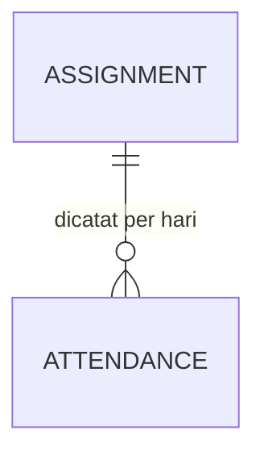

# WorkTrack — Sistem Manajemen Pekerja, Pekerjaan & PR (Fase 1 / MVP)

Status: Disetujui untuk implementasi
Tanggal: 09 September 2026
Sumber: `PRD_Sistem_Manajemen_Pekerja_Pekerjaan_PR.md` (v0.1) + klarifikasi stakeholder (lihat §0)

## 0. Keputusan dari Klarifikasi (mengubah/menegaskan PRD asli)

| # | Topik | Keputusan | Dampak |
|---|---|---|---|
| K1 | Rekap absensi (PRD Asumsi A6) | **Dibalik** — masuk Fase 1 sebagai modul input absensi harian sederhana (Hadir/Tidak Hadir/Izin), bukan sekadar laporan referensi | Entitas baru `Attendance`; §8.4 PRD jadi rekap otomatis, bukan cuma export |
| K2 | Akses NIK & No. Rekening penuh | Admin **dan** Staff Input bisa lihat penuh; Viewer hanya versi masked | Menjawab PRD §12 pertanyaan 2 |
| K3 | Rollup nilai PO ke level Job | Tidak disimpan sebagai kolom — dihitung on-the-fly (`SUM`) saat dibutuhkan | Menjawab PRD §12 pertanyaan 3; tidak ada field tambahan di Job |
| K4 | Migrasi data Excel lama | Migrasi penuh via fitur import (bukan fresh start) | Menjawab PRD §12 pertanyaan 4; fitur import jadi jalur migrasi resmi |
| K5 | Kasus "No. PR sama, Job beda" | Tidak pernah terjadi secara nyata — cukup 3 skenario di Aturan Bisnis #2 PRD | Menjawab PRD §12 pertanyaan 5; tidak ada skema tambahan |
| K6 | Tarif per pekerja (model bisnis jasa: PT jual ke PLN, bayar ke pekerja, margin = selisih) | Tambah 2 field di `Assignment`: `tarif_jual` & `tarif_bayar`, disimpan untuk histori — **kalkulasi otomatis margin/payroll tetap Fase 2** (sesuai PRD §5) | Field tambahan di Assignment, tanpa logika kalkulasi baru di Fase 1 |

Semua asumsi lain di PRD asli (A1–A5, A7, A8) dan Aturan Bisnis §7 PRD **tetap berlaku tanpa perubahan** — dokumen ini adalah pelengkap, bukan pengganti PRD.

## 1. Model Data Final

Entitas yang tidak disebutkan di sini mengikuti definisi PRD §6.3 apa adanya (Employee, Job, JobPeriod, ChangeLog, User/Role).

### 1.1 Assignment (revisi — tambahan field)

| Field | Tipe | Catatan |
|---|---|---|
| id | UUID/bigint | PK |
| employee_id | FK → Employee | |
| job_period_id | FK → JobPeriod | |
| tanggal_mulai | date | |
| tanggal_selesai | date, nullable | |
| status | enum(aktif, selesai, diperbarui) | |
| is_current | boolean | |
| previous_assignment_id | FK → Assignment, nullable | |
| **tarif_jual** | decimal(12,2), nullable | Harga jasa yang ditagihkan ke klien per pekerja (K6) |
| **tarif_bayar** | decimal(12,2), nullable | Harga yang dibayarkan ke pekerja (K6) |
| created_by | FK → User | |
| created_at, updated_at | timestamp | |

Field `tarif_jual`/`tarif_bayar` nullable karena data historis hasil import mungkin tidak selalu punya info ini — tidak memblokir input Assignment tanpa tarif.

### 1.2 Attendance (baru)

| Field | Tipe | Catatan |
|---|---|---|
| id | UUID/bigint | PK |
| assignment_id | FK → Assignment | Menentukan employee + job_period secara implisit |
| tanggal | date | |
| status | enum(hadir, tidak_hadir, izin) | |
| catatan | text, nullable | |
| recorded_by | FK → User | |
| created_at, updated_at | timestamp | |

Constraint: unique(`assignment_id`, `tanggal`) — satu status per hari per assignment.

Divalidasi di aplikasi (bukan hanya DB constraint): `tanggal` attendance harus berada dalam rentang `tanggal_mulai`–`tanggal_selesai` milik assignment terkait (kalau `tanggal_selesai` null, boleh sampai hari ini).

### 1.3 ERD Tambahan

(Relasi lain mengikuti ERD PRD §6.2 tanpa perubahan.)

## 2. Alur & Aturan Bisnis Tambahan

Melengkapi Aturan Bisnis §7 PRD:

6. Input Attendance hanya bisa dilakukan untuk Assignment dengan `status = aktif` atau `diperbarui` (histori) — tidak bisa menambah attendance baru untuk Assignment yang belum dimulai (`tanggal_mulai` di masa depan).
7. Rekap Mingguan (§8.4 PRD, direvisi) menghitung otomatis dari `Attendance` yang overlap dengan rentang tanggal filter — hasilnya menampilkan Job, No. PR, dan status kehadiran per hari per pekerja, bisa diexport ke Excel. Kalau ada hari dalam rentang assignment aktif yang belum diisi attendance-nya, ditandai "belum diisi" (bukan dianggap tidak hadir).
8. `tarif_jual` dan `tarif_bayar` bersifat opsional saat input Assignment — tidak ada validasi/kalkulasi margin di Fase 1, sekadar disimpan untuk kebutuhan Fase 2.

## 3. Modul (revisi dari PRD §8)

- §8.1 Data Karyawan, §8.2 Data Job & Periode PR, §8.3 Assignment & Riwayat, §8.5 User & Role, §8.6 Dashboard — **tidak berubah** dari PRD.
- §8.4 Laporan Referensi Mingguan → **diganti nama & fungsi menjadi "Rekap Absensi Mingguan"**:
  - Sub-modul baru: **Input Absensi** — pilih Job/JobPeriod → tampil grid pekerja aktif × tanggal (7 hari) → klik status per sel.
  - Sub-modul: **Rekap Mingguan** — filter rentang tanggal → tabel Employee, Job, No. PR, status per hari, ringkasan (jumlah hadir/tidak hadir/izin) → export Excel.

## 4. Import & Migrasi (revisi K4)

- Fitur import Excel karyawan (format Image 1) & Job/PR (format Image 2) yang sudah dirancang di PRD §8.1/§8.2 digunakan sebagai **jalur migrasi resmi** dari data lama.
- Urutan migrasi: Employee dulu (validasi NIK unik) → Job & JobPeriod → Assignment (mapping employee ke JobPeriod berdasarkan data Excel) → Attendance tidak dimigrasi (tidak ada data historis granular harian di Excel lama; rekap mulai dari attendance yang diinput sejak sistem live).
- Baris gagal parse/validasi masuk antrian review manual sebelum commit ke database (sesuai Aturan Bisnis #4 PRD).

## 5. Non-Fungsional (tambahan)

- Attendance harian untuk skala PRD (§9: ratusan karyawan) — volume kecil, tidak butuh optimasi khusus, index cukup di `(assignment_id, tanggal)`.
- Semua field `tarif_jual`/`tarif_bayar` dianggap data finansial sensitif setara NIK/rekening — ikut aturan masking K2 (Admin & Staff Input penuh, Viewer masked/hidden).

## 6. Testing

- **Unit**: parser Excel (kolom gabungan → jenis_dokumen+no_dokumen+kode_po), mekanisme versioning Assignment/JobPeriod (append-only, tidak overwrite), validasi tanggal Attendance dalam rentang Assignment.
- **Feature**: 3 skenario pembaruan PR (Aturan Bisnis #2 a/b/c), input & rekap Attendance (termasuk kasus "belum diisi"), akses role (masking NIK/rekening/tarif untuk Viewer), import Excel dengan baris bermasalah masuk antrian review.

## 7. Di Luar Scope Fase 1 (ditegaskan ulang)

- Kalkulasi payroll/margin otomatis dari `tarif_jual`/`tarif_bayar` — Fase 2.
- Jam kerja detail (jam masuk/pulang) — di luar scope, hanya status harian sederhana.
- Reminder H-14 PR akan berakhir, dashboard analitik lanjutan, integrasi PLN/bank — tetap Fase 2/3 sesuai PRD §5 & §11.

## 8. Arsitektur Teknis

Tidak berubah dari PRD §10: Laravel (latest/LTS) + Inertia.js + React (TypeScript) + Tailwind, PostgreSQL 16+, Docker Compose (app, web, postgres, redis, queue-worker, scheduler), `maatwebsite/excel`, `spatie/laravel-permission`.
